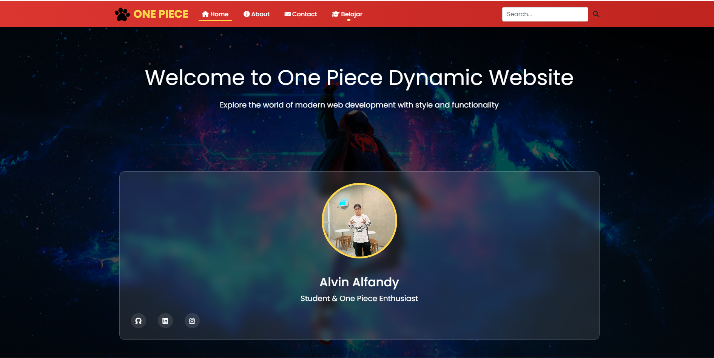
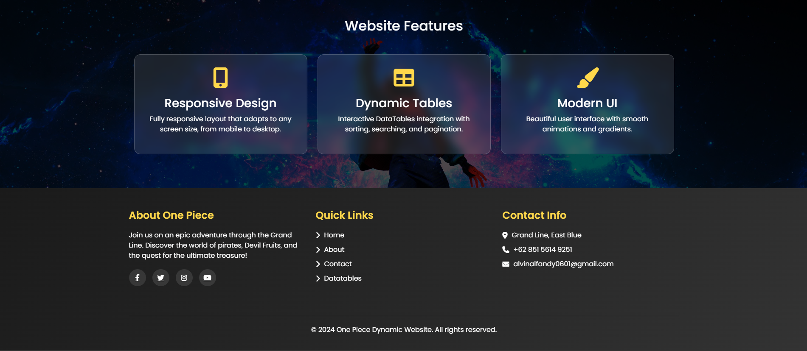
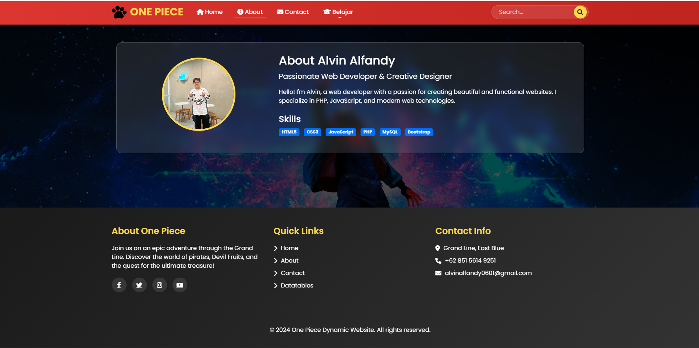
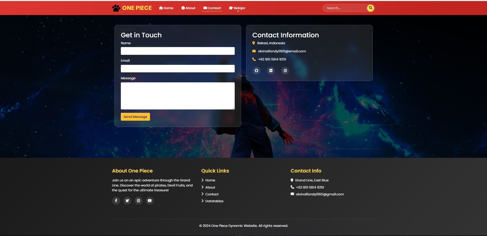
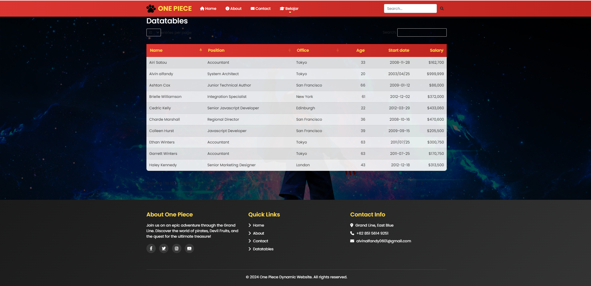

# Dynamic One Piece Website

| Detail      | Keterangan      |
| ----------- | --------------- |
| Nama        | ALVIN ALFANDY   |
| Kelas       | TI.23.A5        |
| NIM         | 312310473       |
| Mata Kuliah | PEMROGRAMAN WEB |

## 📑 Deskripsi Project

Website dinamis dengan tema One Piece yang dibangun menggunakan PHP, Bootstrap, dan DataTables. Website ini menampilkan implementasi berbagai fitur web modern seperti responsive design, dynamic routing, dan interactive data tables.

## 🎯 Fitur Interaktif & Navigasi

### 🔝 Navigation Bar

1. **Logo & Brand**

   - Logo One Piece dengan animasi
   - Brand text "ONE PIECE" dengan styling custom

2. **Menu Utama**

   - Home (dengan ikon rumah)
   - About (dengan ikon info)
   - Contact (dengan ikon amplop)
   - Dropdown Menu "Belajar":
     - DataTables
     - Another Action
     - Something else

3. **Search Bar**
   - Input field dengan placeholder "Search..."
   - Tombol search dengan ikon
   - Animasi hover pada tombol

### 📱 Responsive Features

- Hamburger menu untuk tampilan mobile
- Collapsible navbar
- Responsive grid system
- Adaptive images

## 📄 Detail Halaman & Fitur

### 1. Home Page (home.php)




#### Hero Section

- Welcome message dengan typography custom
- Subtitle dengan efek gradient
- Background dengan overlay semi-transparan

#### Profile Card

- Foto profile dengan border circular
- Nama dan deskripsi
- Social media buttons:
  - GitHub
  - LinkedIn
  - Instagram
- Hover effect pada card

#### Feature Cards

1. **Responsive Design Card**

   - Ikon mobile
   - Deskripsi fitur
   - Hover animation

2. **Dynamic Tables Card**

   - Ikon table
   - Deskripsi DataTables
   - Interactive hover

3. **Modern UI Card**
   - Ikon brush
   - Deskripsi UI/UX
   - Transition effects

### 2. About Page (about.php)



#### Profile Section

- Large profile image
- Nama dan title
- Deskripsi personal
- Background dengan efek blur

#### Skills Section

- Technical Skills dengan badges:
  - HTML5
  - CSS3
  - JavaScript
  - PHP
  - MySQL
  - Bootstrap
- Hover effects pada badges
- Responsive layout

### 3. Contact Page (contact.php)



#### Contact Form

- Input fields:
  - Name (required)
  - Email (with validation)
  - Message (textarea)
- Submit button dengan hover effect
- Form validation

#### Contact Information

- Location dengan icon
- Email address dengan link
- Phone number
- Social media links dengan hover effects:
  - GitHub
  - LinkedIn
  - Instagram

### 4. DataTables Page (datatables.php)



#### Table Features

- Sorting functionality:
  - Name
  - Position
  - Office
  - Age
  - Start date
  - Salary
- Search functionality
- Pagination controls
- Entries per page selector
- Responsive table layout

### 🦶 Footer Section

#### About Column

- About One Piece description
- Social media icons:
  - Facebook
  - Twitter
  - Instagram
  - YouTube

#### Quick Links

- Home
- About
- Contact
- DataTables
- Hover effects pada links

#### Contact Info

- Location
- Phone
- Email
- Social media links

## 🎨 Styling Elements

### Color Scheme

```css
:root {
  --primary: #d32f2f; /* Red */
  --secondary: #fdd835; /* Yellow */
  --accent: #ff9800; /* Orange */
  --dark: #1a1a1a; /* Dark Gray */
  --light: #ffffff; /* White */
}
```

### Special Effects

1. **Glass Morphism**

   - Background blur
   - Transparent overlay
   - Border light effect

2. **Gradients**

   - Navbar gradient
   - Button gradients
   - Background effects

3. **Animations**
   - Hover transitions
   - Smooth scrolling
   - Loading effects
